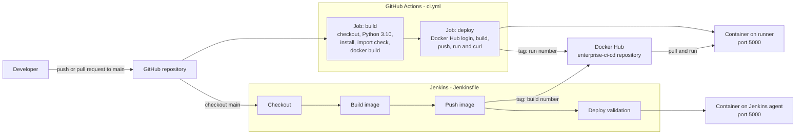
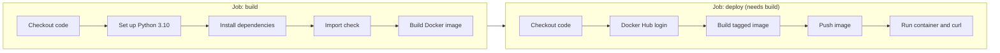
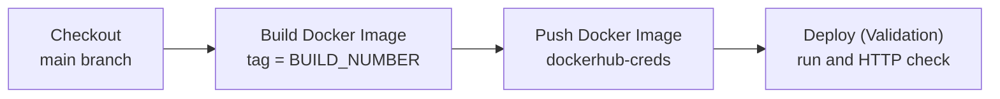

<div align="center">

# Enterprise CI/CD
### One containerized app, two pipelines: GitHub Actions and Jenkins

A Flask application built, tested, published to Docker Hub and validated automatically on every change, using both GitHub Actions and Jenkins side by side.


</div>

---

## Table of Contents

- [Overview](#overview)
- [Architecture](#architecture)
- [Pipeline 1: GitHub Actions](#pipeline-1-github-actions)
- [Pipeline 2: Jenkins](#pipeline-2-jenkins)
- [Tech Stack](#tech-stack)
- [Repository Structure](#repository-structure)
- [The Application](#the-application)
- [The Docker Image](#the-docker-image)
- [Credentials and Secrets](#credentials-and-secrets)
- [Getting Started](#getting-started)
- [Verify a Run](#verify-a-run)
- [Design Decisions](#design-decisions)
- [Troubleshooting](#troubleshooting)
- [Roadmap](#roadmap)
- [Skills Demonstrated](#skills-demonstrated)
- [Author](#author)

---

## Overview

This project takes a small Flask service and delivers it through two independent CI/CD pipelines that follow the same idea:

1. **Build** the code and the Docker image
2. **Publish** the image to Docker Hub with a unique tag for every run
3. **Validate** the release by starting the published image as a container and checking that it answers HTTP requests

| Pipeline | Defined in | Runs on | Triggered by |
|----------|-----------|---------|--------------|
| GitHub Actions | `.github/workflows/ci.yml` | GitHub-hosted `ubuntu-latest` runner | Push or pull request to `main` |
| Jenkins | `Jenkinsfile` | Jenkins agent with Docker installed | Jenkins job for this repository |

Running both shows that the delivery process is defined in code and does not depend on a single tool.

---

## Architecture



---

## Pipeline 1: GitHub Actions

Defined in [`.github/workflows/ci.yml`](.github/workflows/ci.yml). It runs on every push and every pull request to `main`.



| Job | Step | What it does |
|-----|------|--------------|
| `build` | Checkout code | Uses `actions/checkout@v4` |
| `build` | Set up Python | Installs Python `3.10` with `actions/setup-python@v5` |
| `build` | Install dependencies | Runs `pip install -r app/requirements.txt` |
| `build` | Run basic test | Runs `python -c "import app.app"` to confirm the application module imports cleanly |
| `build` | Build Docker image | Builds `enterprise-ci:<run number>` to prove the Dockerfile works |
| `deploy` | Login to Docker Hub | Uses `docker/login-action@v3` with repository secrets |
| `deploy` | Build Docker image | Builds `<username>/enterprise-ci-cd:<run number>` |
| `deploy` | Push Docker image | Publishes the tagged image to Docker Hub |
| `deploy` | Run container from registry | Starts the pushed image on port `5000`, waits 5 seconds, then calls `curl http://localhost:5000` |

The `deploy` job uses `needs: build`, so nothing is published unless the build job passes.

---

## Pipeline 2: Jenkins

Defined in the [`Jenkinsfile`](Jenkinsfile) as a declarative pipeline with `agent any`.



| Stage | What it does |
|-------|--------------|
| **Checkout** | Clones the `main` branch of the GitHub repository |
| **Build Docker Image** | Builds `<image>:<BUILD_NUMBER>` from the Dockerfile |
| **Push Docker Image** | Reads the `dockerhub-creds` credential, logs in with `--password-stdin` so the password never appears in logs, and pushes the image |
| **Deploy (Validation)** | Removes any previous `enterprise-ci` container, starts the new image on port `5000`, waits 5 seconds, then requests the app from inside the container and prints the response |

Pipeline variables:

| Variable | Value |
|----------|-------|
| `IMAGE_NAME` | The Docker Hub repository for this project |
| `IMAGE_TAG` | `${BUILD_NUMBER}`, a new immutable tag for every build |

---

## Tech Stack

| Layer | Technology | Details |
|-------|------------|---------|
| Application | Python, Flask | Single-endpoint web service |
| Containerization | Docker | `python:3.10-slim` base image |
| CI (hosted) | GitHub Actions | Workflow with `build` and `deploy` jobs |
| CI/CD (self-managed) | Jenkins | Declarative pipeline as code |
| Registry | Docker Hub | Private or public repository for the image |
| Source control | Git, GitHub | Both pipelines start from `main` |

---

## Repository Structure

```
enterprise-ci-cd/
├── .github/
│   └── workflows/
│       └── ci.yml            # GitHub Actions pipeline (build and deploy jobs)
├── app/
│   ├── app.py                # Flask application
│   └── requirements.txt      # Python dependencies
├── Dockerfile                # Container image definition
├── Jenkinsfile               # Jenkins declarative pipeline
└── README.md
```

---

## The Application

[`app/app.py`](app/app.py) is a small Flask service. It listens on `0.0.0.0:5000` and returns a single message at `/`:

```
Enterprise CI/CD Pipeline Working
```

The application is intentionally minimal. The point of the project is the delivery pipeline around it.

---

## The Docker Image

Defined in the [`Dockerfile`](Dockerfile).

| Instruction | Purpose |
|-------------|---------|
| `FROM python:3.10-slim` | A small Python base image that keeps the download and attack surface low |
| `WORKDIR /app` | Sets the working directory |
| `COPY app/requirements.txt .` then `RUN pip install --no-cache-dir` | Dependencies are installed **before** the source code is copied, so Docker reuses that cached layer when only the code changes |
| `--no-cache-dir` | Keeps pip's download cache out of the image |
| `COPY app/ .` | Adds the application code |
| `EXPOSE 5000` | Documents the port the app listens on |
| `CMD ["python", "app.py"]` | Starts the Flask server |

---

## Credentials and Secrets

No credentials are stored in the repository.

| Where | Name | Used for |
|-------|------|----------|
| GitHub repository secret | `DOCKER_USERNAME` | Docker Hub login and image name in the workflow |
| GitHub repository secret | `DOCKER_PASSWORD` | Docker Hub login in the workflow |
| Jenkins credential (Username with password) | `dockerhub-creds` | Docker Hub login in the Jenkinsfile |

Use a Docker Hub **access token** instead of your account password for both.

---

## Getting Started

### Run it locally

```bash
docker build -t enterprise-ci-cd .
docker run -d -p 5000:5000 --name enterprise-ci enterprise-ci-cd
curl http://localhost:5000
# Enterprise CI/CD Pipeline Working
```

Without Docker:

```bash
pip install -r app/requirements.txt
python app/app.py
```

### Set up the GitHub Actions pipeline

1. Create a Docker Hub repository named `enterprise-ci-cd`.
2. In your GitHub repository, go to **Settings → Secrets and variables → Actions**.
3. Add `DOCKER_USERNAME` and `DOCKER_PASSWORD` (use an access token).
4. Push a commit to `main` and open the **Actions** tab to watch the run.

### Set up the Jenkins pipeline

1. Install Jenkins on a machine that also has Docker, and let the Jenkins user run `docker` commands.
2. Under **Manage Jenkins → Credentials**, add a *Username with password* credential with the ID `dockerhub-creds`.
3. In the `Jenkinsfile`, change `IMAGE_NAME` to `<your-dockerhub-username>/enterprise-ci-cd`, and update the image name used in the validation stage to match.
4. Create a **Pipeline** job, choose *Pipeline script from SCM*, enter the repository URL, branch `main` and script path `Jenkinsfile`.
5. Click **Build Now**.

---

## Verify a Run

| Where to look | What success looks like |
|---------------|-------------------------|
| GitHub **Actions** tab | Both `build` and `deploy` jobs are green, and the last step prints `Enterprise CI/CD Pipeline Working` |
| Jenkins **Console Output** | All four stages complete and the response text is printed at the end |
| Docker Hub | A new tag (the run or build number) appears on the `enterprise-ci-cd` repository |

---

## Design Decisions

| Decision | Why |
|----------|-----|
| **Two pipelines for one app** | Shows the same delivery process on a hosted service and on a self-managed server |
| **Unique tag per run** | Every image is traceable to a pipeline run, and nothing is silently overwritten as `latest` |
| **`deploy` depends on `build`** | A failing build can never publish an image |
| **Validate the pushed image, not the local build** | The GitHub Actions job runs the image from the registry, which proves the published artifact works |
| **`--password-stdin` for Docker login** | Keeps the password out of process lists and build logs |
| **Dependencies copied before code** | Faster rebuilds through Docker layer caching |
| **Slim base image** | Smaller image and fewer packages to patch |

---

## Troubleshooting

| Symptom | Likely cause | What to check |
|---------|--------------|---------------|
| `denied: requested access to the resource is denied` on push | Wrong Docker Hub username or repository name, or bad credentials | Confirm `DOCKER_USERNAME` and `IMAGE_NAME` match your Docker Hub repository |
| Docker login fails in Actions | Missing or wrong repository secrets | Re-create `DOCKER_USERNAME` and `DOCKER_PASSWORD` |
| The `deploy` job fails on a pull request from a fork | GitHub does not share secrets with fork pull requests | Expected behaviour; run the deploy job only for pushes to `main` |
| `permission denied` on the Docker socket in Jenkins | Jenkins user cannot use Docker | Add it to the `docker` group and restart Jenkins |
| Validation stage cannot connect | The container needs a few seconds to start | Increase the `sleep`, or check `docker logs enterprise-ci` |
| Port `5000` already in use | An old container is still running | Run `docker rm -f enterprise-ci` |

---

## Roadmap

- [ ] Replace the import check with real unit tests (for example `pytest` against the Flask test client)
- [ ] Run the `deploy` job only on pushes to `main`, not on pull requests
- [ ] Use distinct tag prefixes or the commit SHA so the two pipelines never share a tag number
- [ ] Reference `IMAGE_NAME` everywhere in the Jenkinsfile instead of repeating the image name
- [ ] Pin the Flask version in `requirements.txt`
- [ ] Run the container as a non-root user
- [ ] Add a `/health` endpoint and a Docker `HEALTHCHECK`
- [ ] Add image vulnerability scanning (Trivy) as a pipeline stage
- [ ] Extend the delivery step to deploy to Kubernetes
- [ ] Add build notifications (Slack or email)

---

## Skills Demonstrated

- Writing CI/CD pipelines as code in both GitHub Actions YAML and Jenkins declarative syntax
- Containerizing an application with an efficient, cache-friendly Dockerfile
- Publishing versioned images to a container registry
- Automated post-publish validation of a released artifact
- Secure credential handling in two different CI systems
- Designing pipelines where a failed stage stops the release

---

## Author

**Varun Peddi** · DevOps Engineer · AWS Certified Solutions Architect – Associate

[LinkedIn](https://www.linkedin.com/in/varun-peddi/) · [GitHub](https://github.com/vp2103) · contact.varun14@gmail.com
